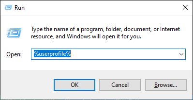
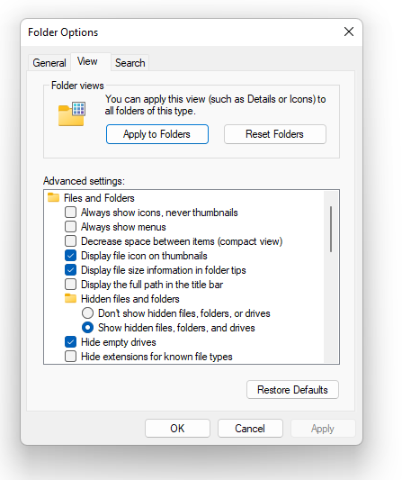
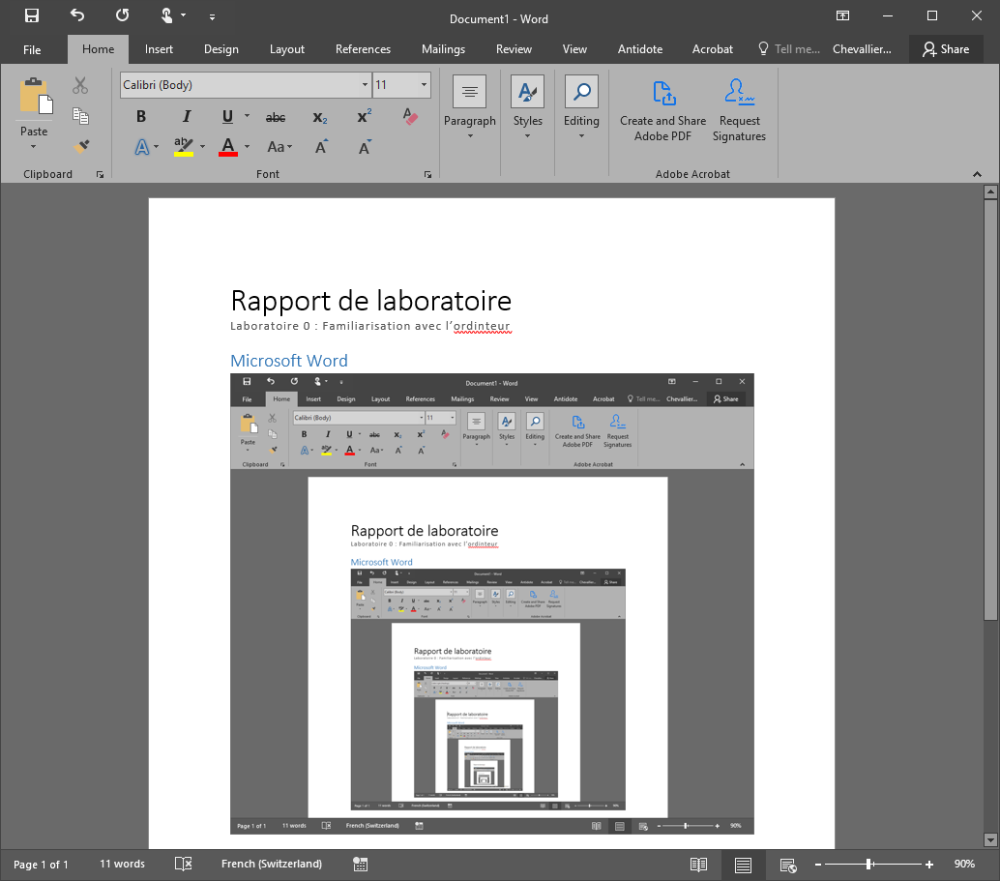
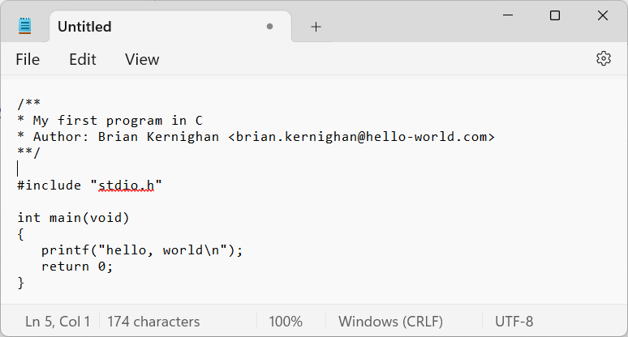
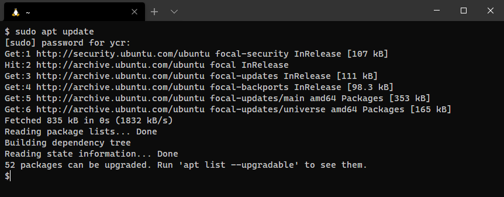

# Labo-00 : prise en main de l'ordinateur <!-- omit in toc -->

| Type       | Description                                                      |
| ---------- | ---------------------------------------------------------------- |
| Durée      | 2x45 minutes + Travail à la maison                               |
| Rendu      | Dossier `rendu` contenant plusieurs fichiers, publié sur GitHub. |
| Format     | Travail individuel                                               |
| Évaluation | Sur la conformité du rapport et de l'archive                     |

## Table des matières <!-- omit in toc -->

- [Introduction](#introduction)
- [Objectifs](#objectifs)
- [Prise en main de votre ordinateur](#prise-en-main-de-votre-ordinateur)
- [Rendu du laboratoire](#rendu-du-laboratoire)
- [Customisation de l'explorateur de fichiers](#customisation-de-lexplorateur-de-fichiers)
- [Microsoft Word](#microsoft-word)
- [Notepad](#notepad)
- [Installation des outils de développement](#installation-des-outils-de-développement)
  - [WSL](#wsl)
    - [Windows Terminal](#windows-terminal)
    - [Familiarisation avec Linux](#familiarisation-avec-linux)
    - [Outils de développement, compilation et exécution](#outils-de-développement-compilation-et-exécution)
  - [Visual Studio Code](#visual-studio-code)
  - [Git](#git)
    - [Configuration de Git](#configuration-de-git)
    - [Identité SSH](#identité-ssh)
- [GitHub](#github)
  - [Création d'un compte](#création-dun-compte)
  - [Déploiement de la clé SSH](#déploiement-de-la-clé-ssh)
    - [Déploiement de votre clé publique](#déploiement-de-votre-clé-publique)
    - [Précisions sur la clé SSH](#précisions-sur-la-clé-ssh)
  - [Acceptation de l'invitation](#acceptation-de-linvitation)
- [Clone du laboratoire](#clone-du-laboratoire)
- [Compilation et exécution d'un programme](#compilation-et-exécution-dun-programme)
- [Livraison du rendu](#livraison-du-rendu)
- [Dernière étape](#dernière-étape)
- [Résumé](#résumé)


## Introduction

Ce travail pratique permet à l'étudiant la prise en main des outils qui seront utilisés durant le semestre. Le cours est essentiellement basé sur l'utilisation de la [ligne de commande](https://fr.wikipedia.org/wiki/Interface_en_ligne_de_commande), il est plus naturel de s'orienter davantage sur un environnement de travail idoine. 

Depuis 2016, Microsoft offre un produit nommé [Windows Subsystem for Linux](https://fr.wikipedia.org/wiki/Windows_Subsystem_for_Linux), de son petit nom **WSL**. Il s'agit d'une [distribution Linux](https://fr.wikipedia.org/wiki/Distribution_Linux) tournant dans Windows. Elle présente l'avantage d'être bien normalisée (respect du standard [POSIX](https://fr.wikipedia.org/wiki/POSIX)), et donne une base solide pour développer plus tard sur [Raspberry PI](https://fr.wikipedia.org/wiki/Raspberry_Pi) et d'autres [systèmes embarqués](https://fr.wikipedia.org/wiki/Syst%C3%A8me_embarqu%C3%A9).

C'est cet outil, WSL, qui sera utilisé pendant ce semestre. Les utilisateurs de [macOS](https://fr.wikipedia.org/wiki/MacOS) et de [Linux](https://fr.wikipedia.org/wiki/Linux) n'en auront pas besoin et pourront développer sans avoir recours à une machine virtuelle Windows.

Linux, macOS et [Windows](https://fr.wikipedia.org/wiki/Microsoft_Windows) sont des [systèmes d'exploitation](https://fr.wikipedia.org/wiki/Système_d'exploitation) dotés d'une interface utilisateur (soit [graphique](https://fr.wikipedia.org/wiki/Interface_graphique) ou en ligne de commande) permettant l'exécution de programmes et la connexion à des réseaux informatiques.

Linux et macOS sont des systèmes dits **POSIX**, c'est-à-dire qu'ils respectent une norme bien précise sur le fonctionnement des systèmes d'exploitation. Cette norme, très appréciée, est utilisée dans de nombreux systèmes : centres de calculs, serveurs web, serveurs de fichiers, satellites, voitures Tesla, fusées spatiales, téléphones mobiles (Android et iPhone) et bien d'autres.

Le système d'exploitation Windows est, quant à lui, très apprécié pour les travaux de bureautique et les terminaux graphiques. De nombreux développeurs utilisent aujourd'hui Windows conjointement avec Linux, ce que nous allons faire durant ce semestre dans ce cours d'introduction à la programmation en C.

## Objectifs

Les objectifs de ce travail pratique sont les suivants :

- Découvrir les environnements Windows et Linux.
- Savoir lire un intitulé de laboratoire ([oui, oui, ce n’est pas si facile](https://en.wikipedia.org/wiki/RTFM)).
- Appliquer la marche à suivre pour obtenir et rendre un travail pratique.
- Découvrir et installer les outils de développement utilisés dans ce cours.

Notons que cela implique l'écriture d'un rapport... Alors, pensez à noter ce que vous faites.

## Prise en main de votre ordinateur

Démarrez votre ordinateur et connectez-vous au [réseau WiFi HEIG-VD](https://intra.heig-vd.ch/services/informatique/poste-de-travail/reseau/wifi/Pages/heig-vd.aspx) de l'école en utilisant vos [identifiants_personnels](https://my.hes-so.ch/pwm/private/login). Votre login est composé de votre prénom et de votre nom, séparés par un point. Notez que votre nom ou prénom peut être tronqué s'il dépasse 8 caractères. Il se peut que vous deviez préfixer votre login avec le nom du domaine informatique de l'école (`einet.ad.eivd.ch`) ou simplement `einet`. Par exemple : `einet\yves.chevalli`.

Une fois connecté à votre ordinateur, explorez les fonctionnalités suivantes :

1. Un simple appui sur la **touche Windows** située à gauche de la barre d'espace, entre les touches `<CTRL>` et `<ALT>`, ouvre le menu **Démarrer** qui vous donne accès à vos programmes.
2. Taper au clavier lorsque le menu Démarrer est ouvert permet de rechercher des programmes.
3. La combinaison de touches `<WIN>` + `<R>` ouvre le menu **Exécuter**, qui vous permet d'entrer le nom du programme à exécuter.
4. La combinaison de touches `<WIN>` + `<E>` lance l'Explorateur de fichiers.
5. La combinaison de touches `<WIN>` + `<L>` verrouille l’ordinateur.
6. La combinaison de touches `<WIN>` + `<MAJ>` + `<S>` lance l'outil de capture d'écran.

Les raccourcis clavier sont nombreux et améliorent le confort de travail. Plus vous en connaissez, plus votre productivité s’améliore. Au début c’est contraignant, mais cela devient ludique avec le temps.

>Une séquence au clavier est exprimée comme une suite de combinaisons de touches. Les chevrons `<>` sont utilisés pour différencier un ou plusieurs caractères d'une touche du clavier. Par exemple, la touche de tabulation (↹) sera indiquée par `<TAB>`, tandis que `TAB` fera référence à la frappe des trois caractères : `T`, `A` et `B`. Lorsque des touches sont séparées par le signe `+`, il s'agit d'une combinaison de touches, c'est-à-dire du maintien simultané de ces touches. Ainsi, `<CTRL>` + `<R>` signifie maintenir la touche **contrôle** enfoncée tout en appuyant sur la touche `R`, puis relâcher les deux touches. Cette notation est souvent abrégée, par exemple `<C-R>` au lieu de  `<CTRL>` + `<R>` . 

Avez-vous compris ? Voici deux séquences de touches, que font-elles ? 

```text
<WIN>+<R> calc <ENTER> <ALT>+<1> <ESC> 314 * 2 = <CTRL>+<C> <ALT>+<F4>
<W-R> notepad <ENTER> <C-V> <C-S> two-pies.txt <ENTER>
```

Exécutez `%userprofile%` depuis le menu *exécuter* (`<W-R>`), l'explorateur de fichiers s'ouvre. Quel est ce dossier ? Si vous ne savez pas, cherchez une référence utile sur internet et intégrez là à votre rapport.



Soyez succinct, votre rapport doit être précis et ne mentionner que l'essentiel.

Répondez brièvement à ces questions dans votre rapport pour montrer que vous avez compris :

1. C'est quoi **POSIX** ?
2. Quel est le raccourci Windows pour exécuter rapidement un programme ?
3. Quel est le raccourci Windows pour verrouiller l'ordinateur ?
4. Que signifie l'acronyme **RTFM**, et pourquoi pensez-vous que c'est important ?

## Rendu du laboratoire

Durant ce travail pratique, vous l'avez maintenant compris, plusieurs documents seront à rendre. Pour vous préparer à ce rendu, commencez par créer un dossier :

1. Dans `Mes Documents` ou sur votre bureau, créez un dossier intitulé `rendu`.
2. Placez-y le fichier `two-pies.txt` créé précédemment.
3. Vérifiez que ce dossier contient maintenant un seul et unique fichier.

*Spoiler alert* : à la fin de ce travail, votre dossier à rendre aura la structure suivante :

```text
./rendu
├── README.md
├── anaphore.txt
├── document.xml
├── hello
├── hello.c
├── rapport.docx
└── two-pies.txt
```

Notez la notion de hiérarchie : le dossier `rendu` contient plusieurs fichiers. Cette hiérarchie fait elle-même partie d'une autre, celle de votre dossier  `Mes Documents` . C'est ce que l'on appelle un arbre de fichiers, ou arborescence.

## Customisation de l'explorateur de fichiers

Par défaut, Windows est optimisé pour le profane. Il est donc essentiel, pour un ingénieur, de modifier certaines options afin d'améliorer son confort de travail. Vous devez, par exemple, ajuster ces options de l'Explorateur de fichiers.



Rendez-vous dans les options de dossier, puis dans l'onglet `Affichage` et décochez l'option suivante :

- [ ] Masquer les extensions des fichiers dont le type est connu.

Cela vous permet de voir les extensions des fichiers, ce qui est très utile pour les identifier. Par exemple, un fichier `hello.c` est un fichier source C, tandis qu'un fichier `hello.exe` est un exécutable. 

Vous devez aussi cocher l'option suivante :

- [ ] Afficher les fichiers, dossiers et lecteurs cachés.

Cela vous permet de voir les fichiers et dossiers cachés, qui ne sont pas affichés par défaut. Par exemple, le fichier `.gitignore` est un fichier caché utilisé pour spécifier les fichiers à ignorer dans un dépôt Git. Nous verrons cela plus tard.

## Microsoft Word

Microsoft Office est la suite bureautique la plus utilisée dans l'industrie. Que vous l'aimiez ou non, vous serez inévitablement amené à l'utiliser dans votre future carrière professionnelle. À cette fin, il vous est demandé de rédiger un rapport dans Microsoft Word en respectant les étapes suivantes :

1. Démarrez Microsoft Word.

2. Créez un nouveau document.

3. Trouvez le menu `Styles`, sélectionnez `Titre` et entrez `Rapport de laboratoire`.

4. Sélectionnez `Sous-titre` et entrez `Laboratoire 00: Familiarisation avec l'ordinteur`.

5. Notez que la faute d'orthographe est soulignée en rouge (le mot "ordinateur" ne s'écrit pas "ordinteur").

6. Utilisez un clic droit sur l'erreur pour la corriger.

7. Entrez ensuite votre nom, prénom et la date du jour.

8. Insérez une section avec `<CTRL>+<ALT>+<1>` intitulé `Microsoft Word`.

9. Faites une capture d'écran et insérez-la dans votre rapport (il s'agit d'une mise en abyme) :

   

10. Gardez votre document ouvert pour la suite des opérations.

11. Une fois toutes les autres étapes terminées, sauvegardez votre rapport dans votre dossier de rendu.

Notez au passage que ce fichier porte l'extension `.docx`, qui est celle des fichiers Microsoft Word. Le `x` indique que le fichier utilise le format `XML` compressé pour stocker les données, un format standard des versions récentes de Word. En réalité, ce fichier est une archive contenant une arborescence de plusieurs fichiers qui peuvent être ouverts avec un éditeur de texte.

Essayez par exemple de créer un fichier Word contenant la phrase : `les biscuits au beurre`. Sauvegardez ce fichier avec le nom `biscuit.docx`, puis renommez-le en changeant son extension à `.zip`. Vous constaterez que l'icône du fichier a changé. En ouvrant ce fichier, vous découvrirez l'arborescence de l'archive compressée. Jetez un coup d'œil au fichier `document.xml` et vous verrez que le texte y est bien présent :

```xml
<w:p w14:paraId="0F5C4F6A"
     w14:textId="4920233C" w:rsidR="00557DE2" w:rsidRDefault="00A65091">
   <w:r>
         <w:t>les biscuits au beurre</w:t>
   </w:r>
</w:p>
```

Intégrez ce fichier `document.xml` à votre dossier de rendu.

## Notepad

Notepad est un éditeur de texte très moyenâgeux, mais diantrement  utile (pensez aussi à installer l'éditeur [Notepad++](https://notepad-plus-plus.org/), qui offre des possibilités supplémentaires).




1. Ouvrez l'éditeur de texte `notepad` depuis `<WIN>+<R> notepad <ENTER>`
2. Saisissez le programme C suivant (sans oublier de changer le nom de l'auteur...) :

   ```c
   /**
   * My first program in C
   * Author: Brian Kernighan <brian.kernighan@hello-world.com>
   **/
   
   #include <stdio.h>
   
   int main(void) 
   {
      printf("hello, world\n");
      return 0;
   }
   ```

3. Sauvegardez-le sous le nom `hello.c` dans votre dossier de rendu. Veillez à ne pas choisir "Document Texte" lors de la sauvegarde pour que l'extension du fichier soit `.c` et non `.c.txt`
4. Quelle est la version de Notepad que vous utilisez ? Vous ne savez pas répondre  ? Utilisez Google, c'est votre meilleur ami.

**Rappel:** pour vous assurer que les fichiers ont la bonne extension (les caractères qui suivent le `.` (point), veillez à activer l'option Windows  `Ne pas masquer les extensions des fichiers dont le type est connu`. Pour le faire, rendez-vous sous Google et essayez par exemple : `montrer extension fichier windows`.

Au passage, bravo, vous venez d'écrire votre premier programme C à l'école d'ingénieurs. Vous êtes un vrai hacker !

## Installation des outils de développement

À présent, il vous est proposé d'installer quelques outils qui vous seront utiles pour la suite de votre bachelor et peut-être même votre master, et peut-être même plus tard lorsque vous serez dans l'industrie.

- **WSL** : un système Linux pour Windows, permettant d'être compatible POSIX.
- **Visual Studio Code** : un éditeur de code.
- **Git** : un logiciel de gestion de version logiciel.

### WSL

[Windows Subsystem for Linux](https://en.wikipedia.org/wiki/Windows_Subsystem_for_Linux) est une couche de compatibilité pour Windows permettant de faire tourner un vrai système Linux sur votre ordinateur Windows. Si vous avez peur de la ligne de commande, n'ayez crainte, nous allons avidement l'utiliser durant ce cours.

**WSL** permet de simplifier le développement de nombreux logiciels prévu pour être compatible POSIX (comme les téléphones Android). Installer WSL vous permettra de suivre quelques exemples cités dans le cours plus simplement que sous Windows.

Pour installer WSL, utilisez la [documentation](https://learn.microsoft.com/en-us/windows/wsl/install) de Microsoft, en choisissant la distribution par défaut, **Ubuntu**.

Une fois WSL et Ubuntu installés, effectuer les opérations suivantes :

1. Exécutez le programme `Ubuntu` maintenant installé.
2. Après quelques instants, il vous est demandé de saisir un nom d'utilisateur puis un mot de passe, choisissez un mot de passe assez simple, il n'est pas très important. Attention, le mot de passe ne s'affiche pas lorsque vous le saisissez, c'est normal et c'est pour des raisons de sécurité. **Important** : Ne sautez pas cette étape. Créez un utilisateur par exemple vos initiales.

#### Windows Terminal

Le programme [cmd.exe](https://fr.wikipedia.org/wiki/Cmd) est plus vieux que vous et depuis Microsoft a développé un nouveau terminal nommé **Windows Terminal**. Pour l'installer, utilisez le **Windows Store** (touche Windows puis `store`). Si vous êtes sous Windows 11, Windows Terminal est déjà installé.

Pour exécuter le  **Windows Terminal**, vous pouvez simplement faire `<W-R> wt <ENTER>`.



Configurez le  **Windows Terminal**  : allez dans les paramètres avec `<CTRL>+,` et choisissez `Ubuntu`  comme le profil par défaut. Choisissez aussi comme terminal par défaut `Windows Terminal`. 
Dans  `Interaction` activez `Automatically copy selection to clipboard`.

#### Familiarisation avec Linux

Pour se familiariser avec les exécutables Linux essayons d'installer un programme. Tout d'abord vous devez lancer un terminal. Exécutez Windows Terminal puis depuis le menu déroulant `v` juste à droite du `+` sélectionnez `Ubuntu`.

Depuis l'invité de commande qui s'offre à vous :

1. Mettre à jour la liste des logiciels disponibles avec : `sudo apt update`.

2. Installer le programme `cowsay` (vache qui parle) avec `sudo apt install cowsay`.

3. Exécuter `cowsay` suivi d'une phrase de votre choix, p. ex. :

   ```text
   $ cowsay Meuuuuuh
   __________
   < Meuuuuuh >
   ----------
         \   ^__^
          \  (oo)\_______
             (__)\       )\/\
                ||----w |
                ||     ||
   ```

4. Affichez le manuel du programme avec la commande `man cowsay` (quittez avec la touche `q`, naviguez avec `j` et `k`).

5. Cherchez dans le manuel que fait l'option `-d`.

6. Essayez cette option : `cowsay -d Meuuuuuh`.

7. Essayez une autre option possible de ce programme, copiez le texte de sortie et insérez-le dans votre rapport.

8. (optionnel) à votre avis, quelle ligne de commande permet d'afficher ceci ?

   ```text
   ---------------------
   ( Bilbon, je t'aurais )
   ---------------------
         o                    / \  //\
         o    |\___/|      /   \//  \\
               /0  0  \__  /    //  | \ \
            /     /  \/_/    //   |  \  \
            @_^_@'/   \/_   //    |   \   \
            //_^_/     \/_ //     |    \    \
         ( //) |        \///      |     \     \
         ( / /) _|_ /   )  //       |      \     _\
      ( // /) '/,_ _ _/  ( ; -.    |    _ _\.-~        .-~~~^-.
   (( / / )) ,-{        _      `-.|.-~-.           .~         `.
   (( // / ))  '/\      /                 ~-. _ .-~      .-~^-.  \
   (( /// ))      `.   {            }                   /      \  \
   (( / ))     .----~-.\        \-'                 .~         \  `. \^-.
               ///.----..>        \             _ -~             `.  ^-`  ^-_
                  ///-._ _ _ _ _ _ _}^ - - - - ~                     ~-- ,.-~
                                                                     /.-~
   ```

Ce que vous devez retenir :

- Pour installer un programme sous Linux Ubuntu, utilisez la commande `apt install` suivie du nom du programme que vous souhaitez installer.
- Pour consulter l'aide d'un programme, utilisez la commande `man`, qui affiche le manuel du programme.
- L'appel d'un programme peut être modifié avec des options, comme `-d`.

#### Outils de développement, compilation et exécution

Installez les programmes qui seront utilisés pour le développement de code.

   ```sh
$ sudo apt update && sudo apt upgrade -y && sudo apt autoremove
$ sudo apt install build-essential gdb make git
   ```

Vérifiez la version de chacun de ces programmes :

   ```sh
$ gcc --version
$ gdb --version
$ make --version
$ git --version
   ```

### Visual Studio Code

[Visual Studio Code](https://code.visualstudio.com/) est un éditeur de code extensible développé par [Microsoft](https://fr.wikipedia.org/wiki/Microsoft) pour Windows, Linux et macOS. Il est un bon point de départ pour programmer dans différents langages (C, C++, Python, JavaScript, Perl, Java...).

Cet éditeur a été choisi pour ce cours, car il est très complet, assez léger et, surtout, fonctionne bien sous Windows (avec WSL), macOS, et Linux.

> Vous pouvez vous rendre sur [2023 Developer Survey](https://survey.stackoverflow.co/2023/) et descendre à *Integrated development environment* [ici](https://survey.stackoverflow.co/2023/#section-most-popular-technologies-integrated-development-environment). Constatez quel est l'éditeur le plus populaire dans la communauté en 2023.

Allez, en avant, installons Visual Studio Code...

1. Installez Visual Studio Code.
2. Exécutez Visual Studio Code.
3. Avec le raccourci `<CTRL> + <K> <CTRL> + <O>`, ouvrez votre dossier de rendu. Sur la gauche de la fenêtre, vous avez la liste des fichiers de votre dossier.
   
4. Ouvrez le fichier `hello.c` que nous avons écrit plus haut.
5. Notez que cette fois-ci vous avez des couleurs.
6. Avec `<CTRL>+<SHIFT>+<P>` faites apparaître le menu de commande et cherchez `Preferences: Color Theme` et choisissez un thème qui vous convient.
7. Faites une capture d'écran et intégrez là dans votre rapport.

*Note importante* : L'anglais est la langue de la programmation. Il est donc important de s'habituer à lire et écrire en anglais. Si vous avez des difficultés, vous pouvez utiliser un traducteur en ligne. Cela va de même pour la langue de vos logiciels. Forcez-vous à utiliser Visual Studio Code en anglais. Vous pouvez changer la langue de l'interface : Appuyez sur `<CTRL>+<SHIFT>+<P>` pour ouvrir la palette de commandes, commencez à taper "display" pour afficher la commande "Configure Display Language".

Sous Visual Studio Code, créez un nouveau fichier `anaphore.txt` et écrivez-y l'anaphore célèbre de Aragon :

> Vingt et trois qui donnaient le coeur avant le temps
> Vingt et trois étrangers et nos frères pourtant
> Vingt et trois amoureux de vivre à en mourir

Vous constatez que le mot `trois` apparaît `trois` fois. Vous pouvez placer votre curseur sur ce mot et utiliser deux fois le raccourci `<CTRL>+<D>` pour sélectionner les autres occurrences de ce mot. Vous pouvez ensuite les modifier en même temps. Essayez de changer le mot `trois` en `quatre` et constatez que les autres occurrences sont modifiées en même temps. Félicitation, vous venez d'utiliser l'option multicurseurs de Visual Studio Code.

Intégrez le fichier `anaphore.txt` modifié dans votre dossier de rendu.

Utilisez la combinaison `<CTRL>+<SHIFT>+<X>` pour afficher les extensions et installez les extensions suivantes :

- WSL (côté Windows, ou *local*).
- C/C++ (côté WSL).
- Clang-Format (côté WSL).
- Markdown All in One (côté WSL).

### Git

Git est un logiciel de gestion de version très utilisé par les développeurs de logiciels. Il est utilisé dans ce cours comme outil principal pour accéder aux énoncés de laboratoire et soumettre vos modifications. Avantageusement, Git est déjà installé avec Ubuntu 22.04, mais nous devons le configurer avant de pouvoir l'utiliser.

#### Configuration de Git

[Git](https://git-scm.com/) utilise deux informations pour vous identifier : votre **nom** et votre **e-mail**. Pour configurer votre identité, exécutez depuis un terminal Ubuntu puis les commandes suivantes en remplaçant ce très cher `Emmet` par votre humble patronyme :

   ```sh
   git config --global user.name "Emmet Lathrop Brown"
   git config --global user.email emmet.brown@heig-vd.ch
   ```

Notez au passage la structure de ces commandes :

1. `git` c'est le nom du programme que vous exécutez.
2. `config` c'est une *sous commande* permettant de configurer Git.
3. `--global` il s'agit d'un modificateur reconnaissable à ses deux tirets, qui indique que nous souhaitons modifier la configuration globalement dans tout Ubuntu.
4. `user.name` c'est le paramètre de configuration que vous voulez modifier.
5. `"Emmet Lathrop Brown"` c'est une chaîne de caractère comportant le prénom suivi du nom.

> Chacun des éléments passés après le nom du programme est nommé des **arguments**, et les arguments qui commencent par un tiret simple ou double sont nommés des **options**.

#### Identité SSH

Maintenant que votre identité est saisie, nous souhaitons créer une clé cryptographique pour vous permettre de communiquer à l'abri des mauvaises oreilles avec d'autres ordinateurs sur internet. Cette clé s'appelle *clé SSH* pour *Secure SHell* (littéralement coquille sécurisée, mais tout le monde utilise le terme *shell*).

Pour créer votre clé, utilisez simplement la commande:

```sh
ssh-keygen
```

Utilisez toutes les valeurs par défaut (c'est-à-dire appuyez sur `<Enter>` jusqu'à la fin du programme). Dans le cas de ce cours, et à moins que vous ne travaillez aussi pour une agence de renseignement, je vous propose de laisser la `passphrase` (phrase secrète) vide.

À l'issue de cette étape, vous obtiendrez quelque chose comme ceci :

```sh
Generating public/private rsa key pair.
Enter file in which to save the key (~/.ssh/id_rsa): (appuyez sur <Enter>)
Created directory '~/.ssh'.
Enter passphrase (empty for no passphrase):
Enter same passphrase again:
Your identification has been saved in ~/.ssh/id_rsa.
Your public key has been saved in ~/.ssh/id_rsa.pub.
The key fingerprint is:
SHA256:roMkIIUQP4DcTzitPsPCNjIA/myLCwZbjkQl0wJ6xm0 john-doe@einet
The key's randomart image is:
+---[RSA 3072]----+
|X=o.o            |
|=*=* o           |
|+oB E            |
|=+ + .           |
|=o*     S        |
|=X.O.  .         |
|*o*o+.  .        |
|o. .. ..         |
| ..   ..         |
+----[SHA256]-----+
```

Ce programme a créé deux clés:

- Une clé privée que vous ne devez jamais communiquer à personne (ni même votre professeur, vos amis ou votre maître chanteur).
- Une clé publique que vous pouvez transmettre à ceux qui souhaitent communiquer avec vous.

La clé publique découle de la clé privée. Elle y est intrinsèquement liée. Si vous perdez votre clé privée, vous ne pourrez plus communiquer avec les autres ordinateurs. Si vous perdez votre clé publique, vous pourrez toujours communiquer avec les autres ordinateurs, mais personne ne pourra communiquer avec vous.

Plus haut nous avons pu lire: `Your public key has been saved in ~/.ssh/id_rsa.pub` (*Votre clé publique a été sauvée dans ~/.ssh/id_rsa.pub*). Pour consulter votre clé, utilisez le programme `cat` qui permet de voir le contenu d'un fichier :

```sh
cat ~/.ssh/id_rsa.pub
```

Vous devriez obtenir un texte étrange avec plein de chiffres et de lettres de `a` à `f` et commençant par `ssh-rsa`. Copiez ce texte et insérez-le dans votre rapport. Par exemple, ma propre clé SSH publique est la suivante :

```sh
ssh-rsa AAAAB3NzaC1yc2EAAAADAQABAAABAQC+yNp7af6zI8NINIFX1aRj+nzKksZ6XzBSkgA/iuPpYIGz5SSZOkwkvN0DnX8J42DcuEK/mnu3+f9Wh746823gxhXqtj+7Wv9z9DJ9O9qrsYlnxIMipoqepE/Xt+jE5Yv8ullIdsvZdzY611R5DFwrVswslz9OdmpH6nWCmnY/cGZva79ngdcvJLKFk++fl+Be1xshWt24svawRH7Fdxn8VyUKmP2Twy6iMo3MT9xGe5leV1CiTXfkzLYntNV50/dtzQN+pwcwRBdXBP9FdO9+IzieY6bUGttT6t2VcWoK6jFF+i94Chl/FeGvRU1X/QzSP3SYT2biNRNmznSIa2VD
```

Maintenant, si vous voulez *impressionner votre professeur et gagner des points supplémentaires*, mettez dans votre rapport le contenu de votre clé privée accessible depuis `cat ~/.ssh/id_rsa`.

## GitHub

[GitHub](https://github.com/) est une plateforme en ligne pour les développeurs, permettant le partage et la collaboration sur des projets [open source](https://fr.wikipedia.org/wiki/Open_source). Elle compte plus de 100 millions d'utilisateurs et 300 millions de projets. Étant donné que cet outil est massivement utilisé dans le développement logiciel, il est important que tout étudiant en ingénierie s'y familiarise. Ainsi, les travaux pratiques utiliseront le plus souvent Git et GitHub.

### Création d'un compte

Avant toute chose, et si ce n'est pas déjà fait, il vous faut créer un compte GitHub.

1. Allez sur [GitHub](https://github.com/).
2. Sélectionnez `Sign Up` et créez un compte GitHub.
3. Choisissez un `username` : pour simplifier le travail du professeur, utilisez `nom-prenom` en **minuscule** et avec un tiret. C'est la convention d'usage de nommer en minuscule les mots séparés par des tirets.
4. Utilisez votre e-mail de la HEIG-VD afin de bénéficier des avantages du programme [GitHub_Education](https://github.com/education).

### Déploiement de la clé SSH

#### Déploiement de votre clé publique

Vous rappelez-vous, nous avions créé une clé `SSH` pour sécuriser nos transactions avec Git. Il est temps d'ajouter cette clé à votre compte GitHub.

1. Ayez sous la main votre clé publique de la forme:

   ```text
   ssh-rsa AAAAB3NzaC1yc2EAAAADAQABAAABAQC3RiOdvxC/+qW0IDpb0UGPFgFOMqKLzzJ
   MxRLNbRN2QIcCvLbLUI0UmzOYvLoawXtmv3W3N+kvVCKc/ED+hAOorx1P2ZaFbyzim6PjBU
   0tBGKWZoN5Ds4rujNo7h1IO5uugFjC7KyDLfCUk+1gAuiDDYy2hLZn+Agfh9oG6YONVEYDX
   rOZeNK0UhwNahZxjHWQK0No4nvK9Al0IpChY5Y3Kz+shHtYYNXiFtYSgz86BbiAwjzkIh32
   wAa349VT4FmVWlSyVX0c2ZlwEUogXfKrM3IFjH+bqOwKCWL1BjNdi/geJ9tlRTiy4lpa5AW
   rdHCpz7NuBfXbaMjEjgH doc@hill-valley
   ```

2. Rendez-vous sur GitHub dans *Settings* puis dans l'onglet *SSH and GPG keys*.
3. Ajoutez une nouvelle clé SSH avec *New SSH key*.
4. Copier/coller votre clé publique.
5. Nommez votre clé `HEIG-VD`.

#### Précisions sur la clé SSH

Votre identifiant GitHub (login/password) vous permet d'accéder au site internet de GitHub et de protéger son accès. La clé SSH permet d'échanger des données de façon sécurisée entre votre ordinateur et GitHub sans devoir entrer votre mot de passe à chaque fois. C'est une sorte de contrat tacite. Cela sera utile pour le rendu de labos.

Votre clé SSH vous permet aussi d'accéder à d'autres ordinateurs à distance depuis Linux (par exemple un Raspberry PI), elle n'est pas uniquement dédiée à Git. 

### Acceptation de l'invitation

Votre professeur vous a envoyé un lien vers un travail GitHub Classroom, cliquez sur ce lien, sélectionnez votre nom et acceptez l'invitation en cliquant sur *Accept this assignment*. Un message indique :

>You accepted the assignment, labo-00 . We're configuring your repository now. This may take a few minutes to complete. Refresh this page to see updates.

Patientez quelques secondes puis rafraichissez la page avec la touche F5. Vous aurez le message:

>You’re ready to go!
>You accepted the assignment, labo-00.
>Your assignment repository has been created:
>https://github.com/info1-mt-a/labo-00-nom-prenom

Cliquez sur le lien puis cliquez sur le bouton vert `Code`. Choisissez `SSH` et copiez l'adresse du référentiel. Elle devrait ressembler à quelque chose comme :

```sh
git@github.com:info1-mt-a/labo-00-nom-prenom.git
```

## Clone du laboratoire

Pour récupérer une copie de votre travail, vous devez faire un *clone* de votre *référentiel*. Maintenant que vous avez copié l'adresse de votre référentiel, effectuez les opérations suivantes :

1. Lancer un terminal Ubuntu.
2. Cloner le référentiel de ce travail pratique avec la commande suivante :

   ```sh
   git clone git@github.com:info1-mt-a/labo-00-nom-prenom.git
   ```

3. Naviguer dans ce répertoire avec `labo-00-nom-prenom` (vous pouvez simplement écrire `cd lab` puis appuyer sur la touche `TAB` pour compléter le nom du répertoire automatiquement).
4. Ouvrez le projet avec Visual Studio Code avec `code .` (n'oubliez pas l'espace et le point).

C'est principalement ces commandes que vous répéterez tout au long du semestre : `git clone`, `cd`, `code .`

## Compilation et exécution d'un programme

Depuis le terminal Ubuntu, dans le répertoire `labo-00` que vous avez récupéré, utilisez la commande `explorer.exe .` (n'oubliez pas le point) pour ouvrir l'explorateur de fichiers Windows dans le dossier courant. Copiez le fichier `hello.c` dans ce dossier. Ce fichier contient le *code source* de votre programme.

   ```sh
$ cd labo-00
$ explorer.exe .  # mettre manuellement le fichier hello.c dans le répertoire labo-00
$ ls
hello.c
   ```

Compilez le code source `hello.c` pour produire un programme exécutable nommé `hello` :

   ```sh
$ gcc hello.c -o hello
$ ls
hello  hello.c
   ```

Exécutez le programme `hello`, ce qui affiche la phrase "hello, world" :

   ```sh
$ ./hello
hello, world
   ```

Bravo, vous avez écrit, compilé et exécuté votre premier programme 🥰

## Livraison du rendu

Pour livrer votre travail, il vous est demandé de publier vos fichiers sur GitHub.

Depuis le terminal Ubuntu, dans le répertoire `labo-00` que vous avez récupéré, créez un dossier `rendu` avec la commande `mkdir rendu`. Puis, déplacez-vous dans ce dossier avec `cd rendu`. Avec la commande `explorer.exe .` (n'oubliez pas le point), vous ouvrez l'explorateur de fichier Windows dans le dossier courant. Copiez les fichiers demandés dans ce dossier, sauf le fichier `README.md` qui sera créé dans l'étape suivante.

```text
./rendu
├── README.md
├── anaphore.txt
├── document.xml
├── hello
├── hello.c
├── rapport.docx
└── two-pies.txt
```

À partir de la console, il faut maintenant ajouter les fichiers à la liste des fichiers à publier avec la commande `git add .`,
et ensuite créer un *commit* avec la commande `git commit -m "Travail terminé"`. Enfin, il faut publier les changements avec la commande `git push`.

Rendez-vous sur [GitHub](https://github.com/) et vérifiez que vos changements ont été publiés correctement. Votre professeur peut maintenant y accéder directement et évaluer votre travail.

## Dernière étape

Pour terminer ce travail pratique, il vous est demandé de créer un fichier `README.md` dans le dossier `rendu` avec le contenu suivant :

```markdown
# Labo-00

Ce dossier contient le rendu de mon laboratoire Info1, j'ai été heureux de le réaliser.

Je me suis familiarisé un peu avec Markdown, ci dessous quelques exemples de ce que l'on peut faire avec :

> Vous vous inspirerez du fichier source de la donnée du laboratoire (fichier README.md à la racine du référentiel) pour donner quelques exemples de ce que l'on peut faire en Markdown.
```

Notez que vous pouvez visualiser ce que vous écrivez en direct dans Visual Studio Code. Pour cela, vous pouvez utiliser la commande `Markdown: Open Preview to the Side` depuis le menu des commandes, ou depuis le raccourci `<CTRL>+<K> <V>`.

Une fois terminé, il ne reste que trois commandes à utiliser :

1. `git add rendu/README.md`
2. `git commit -m "Ajout fichier Markdown"`
3. `git push`

## Résumé

Bravo, vous venez de terminer ce premier travail pratique. Au cours de cette procédure, vous avez pu :

- Accéder aux infrastructures réseau de l'école.
- Créer un rapport Word.
- Installer Linux sous Windows.
- Configurer Git.
- Créer un compte sur GitHub.
- Créer et déployer une clé SSH.
- Installer Microsoft Visual Studio Code (VSC).
- Écrire un programme en C, le compiler et l'exécuter.
- Utiliser Git et GitHub.
- Vous familiariser avec la syntaxe Markdown.
- Exécuter des programmes sous Linux, comme `cowsay`.
- Livrer votre travail sur GitHub.
